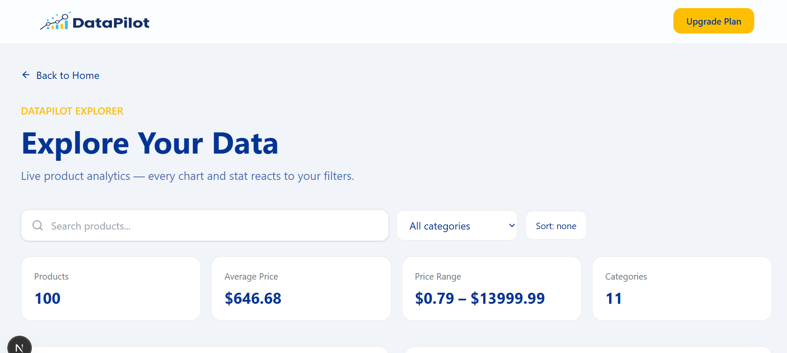
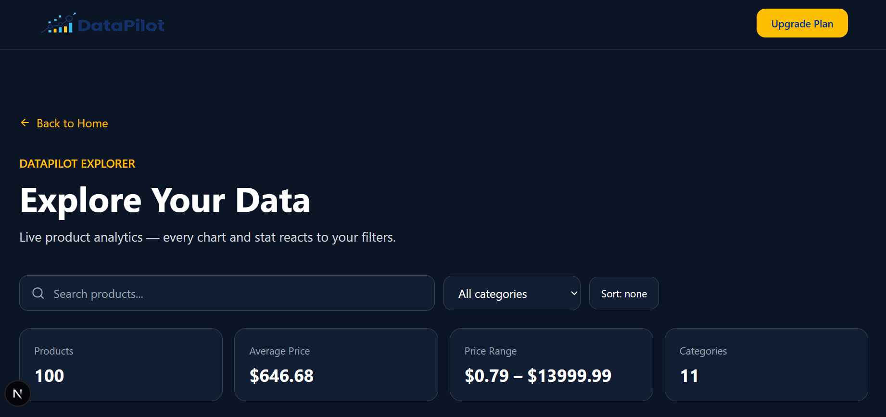
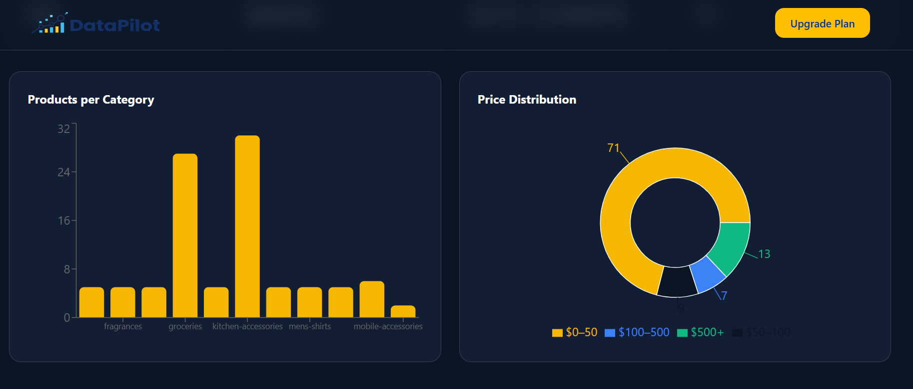
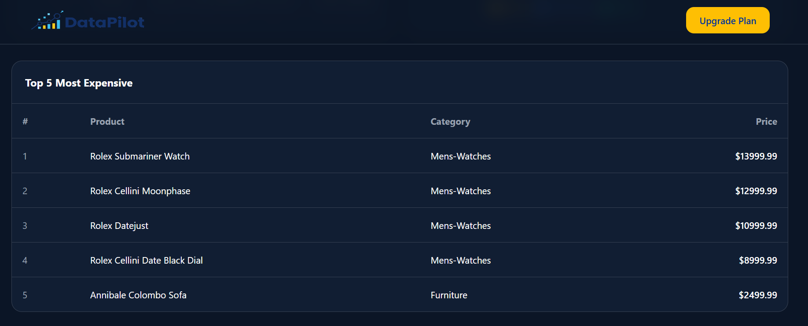
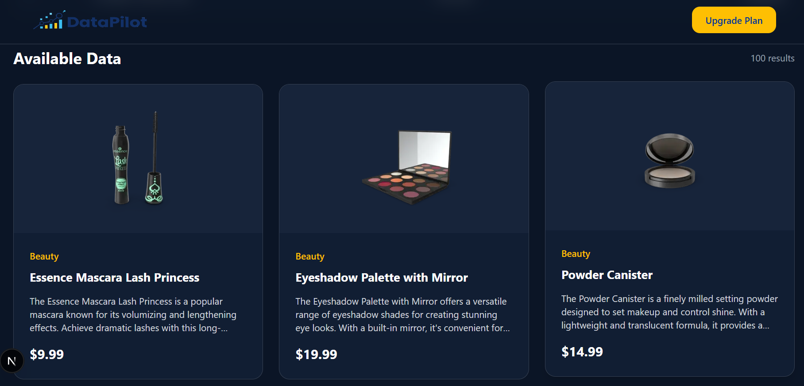
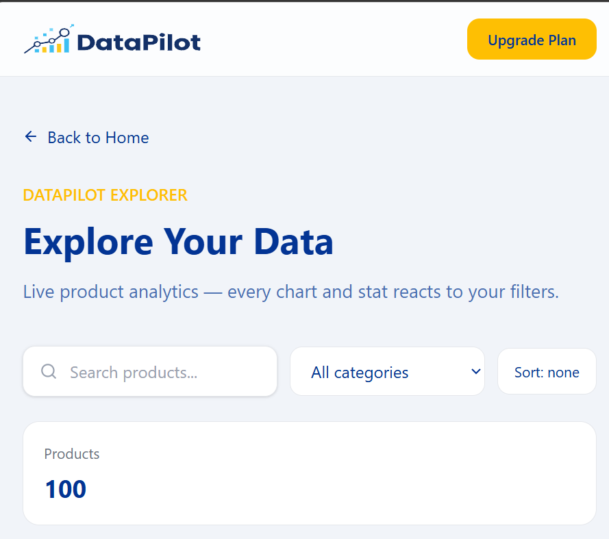
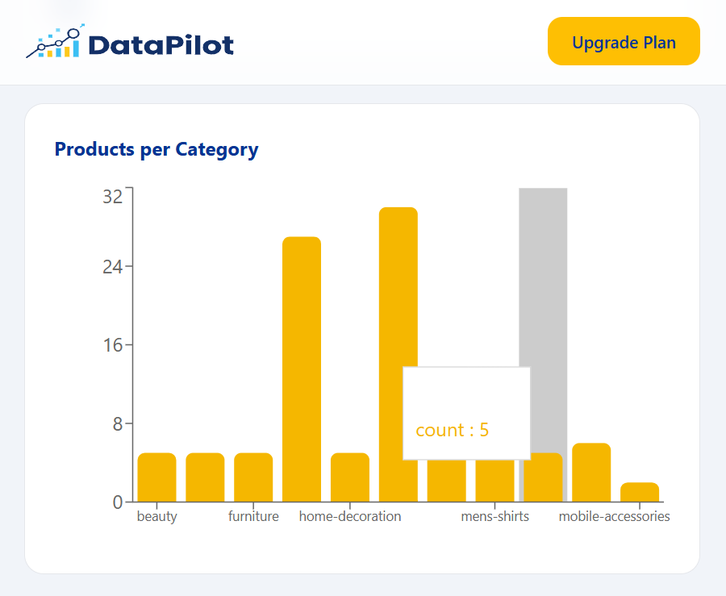
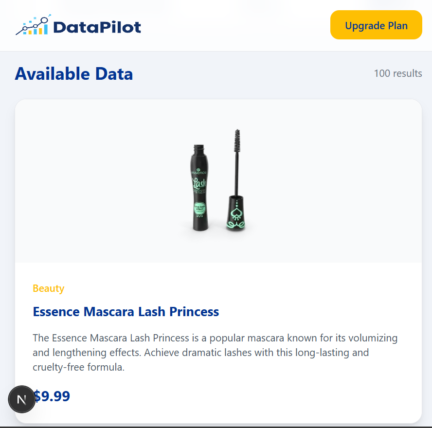

# DataPilot

A modern, responsive marketing website for **DataPilot** — a data analytics platform that helps teams understand their data through powerful analytics and intelligent insights.

Built with **Next.js**, **React**, **Tailwind CSS v4**, and **TypeScript**.

## Features

- **Fully responsive** — mobile-first layout with hamburger menu, tablet and desktop breakpoints
- **Dark / light mode** — manual toggle with system preference detection, saved to `localStorage`
- **Animated mobile menu** — smooth max-height/opacity transitions
- **FAQ accordion** — smooth expand/collapse with accessibility attributes
- **Contact form** — client-side validation with inline error messages
- **Theming** — custom brand colors via Tailwind v4 `@theme` tokens

## Tech Stack

| Tool | Purpose |
| --- | --- |
| Next.js (App Router) | Framework |
| React | UI components |
| TypeScript | Type safety |
| Tailwind CSS v4 | Styling |
| next/link | Client-side navigation |

## Project Structure

```javascript
├── app/                  # Pages and layouts
├── components/
│   ├── Navbar.tsx        # Header with mobile menu + theme toggle
│   ├── ThemeToggle.tsx   # Dark/light mode toggle
│   ├── Footer.tsx        # Footer with contact info + form
│   ├── ContactForm.tsx   # Validated contact form
│   ├── TestimonialsSection.tsx
│   └── TestimonialCard.tsx
├── public/assets/        # Images and SVGs (logo, icons, photos)
└── globals.css           # Tailwind v4 config, theme tokens, dark variant
```

## Getting Started

```bash
# Install dependencies
npm install

# Run the dev server
npm run dev
```

Open [http://localhost:3000](http://localhost:3000) in your browser.

## APP link
[text](https://fda-landing-page.vercel.app/)
## Dark Mode

Dark mode is class-based. The theme is applied by toggling the `dark` class on `<html>`, with the preference persisted in `localStorage`. The Tailwind v4 dark variant is defined in `globals.css`:

```css
@custom-variant dark (&:where(.dark, .dark *));
```

## Custom Theme Colors

Defined in `globals.css` under `@theme`:

| Token | Color |
| --- | --- |
| `--color-dp-navy` | `#033494` |
| `--color-dp-blue` | `#075B91` |
| `--color-dp-yellow` | `#FEBF03` |
| `--color-dp-light` | `#F1F1F1` |
| `--color-dp-card` | `#C7D5DA` |
| `--color-dp-text` | `#243B5A` |
| `--color-dp-bluee` | `#2B638D` |

Use them as utility classes, e.g. `text-dp-yellow`, `bg-dp-navy`.

## Data Explorer
DataPilot now includes an interactive Data Explorer page that demonstrates real-world API integration and client-side data analysis.

- Live API integration — Fetches product data from the DummyJSON REST API
- Asynchronous data fetching — Uses React useEffect to request data when the page loads
- Loading state — Displays a loading spinner while API data is being retrieved
- Error handling — Displays a user-friendly error message when the API request fails
- Dynamic rendering — Product cards are generated dynamically using React .map()
- Search functionality — Search products by title in real time
- Category filtering — Filter products by their category
- Price sorting — Sort products from low-to-high or high-to-low price
- Dynamic KPI statistics — Displays product count, average price, price range, and category count
- Product category analytics — Visualizes the number of products in each category
- Price distribution analytics — Displays product distribution across different price ranges
- Top products analysis — Shows the five most expensive products
- Responsive dashboard — Analytics and product cards adapt to different screen sizes

## API Integration
The Data Explorer uses the DummyJSON Products REST API as a live external data source.

Endpoint:

https://dummyjson.com/products?limit=100

The application fetches the product data when the Explorer page is mounted.

The basic fetching flow is:

useEffect(() => {
  const fetchProducts = async () => {
    try {
      const response = await fetch(
        "https://dummyjson.com/products?limit=100"
      );
      if (!response.ok) { throw new Error("Failed to fetch products"); } const json = await response.json(); setProducts(json.products); } catch (err) { setError( err instanceof Error ? err.message : "Something went wrong" ); } finally { setIsLoading(false); } }; fetchProducts(); }, []);

## Fetching State 
The application manages three important API states:

**Loading:**

While the request is being processed, the application displays a loading spinner instead of attempting to render incomplete data.

**Success:**

After the API responds successfully, the product data is stored in React state and dynamically rendered on the page.

**Error:**

If the API request fails, the application displays a clear error message instead of crashing.

This provides a more reliable user experience when working with external data sources.

## Data Filtering and Search

The Explorer does not modify the original API response when filtering data.

Instead, it creates a derived filtered dataset based on the current search term and selected category.

const filteredProducts = useMemo(() => {
  let result = products.filter(
    (p) =>
      p.title.toLowerCase().includes(searchTerm.toLowerCase()) &&
      (selectedCategory === "all" ||
        p.category === selectedCategory)
  );

  return result;
}, [products, searchTerm, selectedCategory]);

This allows the original API data to remain unchanged while the displayed results update instantly.

Users can:

- Search for a product
- Select a category
- Sort products by price
- View the updated analytics automatically

## Dynamic Analytics

The Explorer dashboard calculates analytics directly from the currently filtered dataset.

**KPI Metrics**
- Total number of products
- Average product price
- Minimum and maximum price
- Number of available categories
**Charts**

The dashboard uses Recharts to visualize the data.

Products per Category

A bar chart displays how many products belong to each category.

Price Distribution
A pie chart groups products into different price ranges:

- $0–50
- $50–100
- $100–500
- $500+

Because the charts are derived from the filtered data, they automatically update when the user searches or changes the category filter.

## Screen shots
Desktop:








Mobile:






## Author
Samira Hammouche

## License

© 2026 DataPilot. All rights reserved.